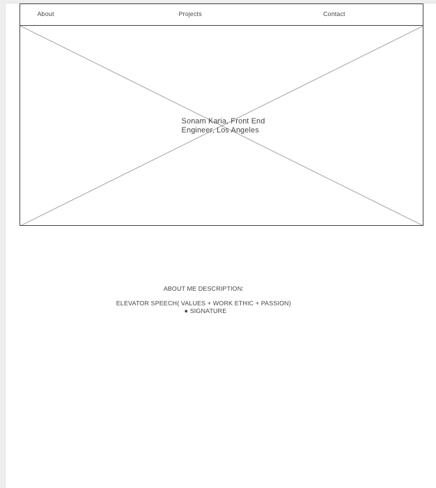
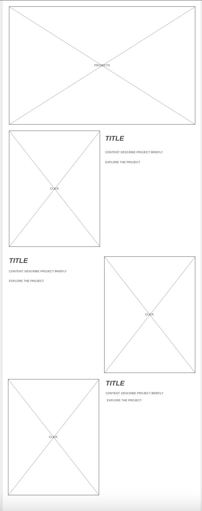
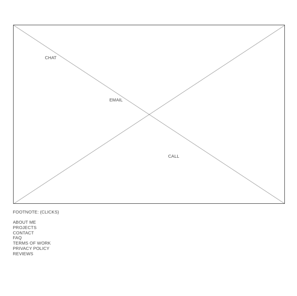

### Project Scedule
|Day |Deliverable|Status|
|---|---|---|
| Day 1  | Project Description  |  Complete |
| Day 2  | WireFrames/Priority Matrix/Timeline  | Complete  |
| Day 3  | Core Application Structure(HTML, CSS, Javascript)  | In Progress  |
| Day 4  | MVP & Fixes  |  Incomplete |
| Day 5  | Final Touches  | Incomplete  |
| Day 6  |  Present | Incomplete  |

### WireFrame

### Time Priority Matrix

#### MVP
| Component  | Priority  |  Status | Actual Time  |
|---|---|---|---|
| Hamburger Menu  | H  | 1HR  | 1HR  |
| Project Previews  | H | 1HR  | H|
| Regular Nav  | H | 1HR  | H|
| Adding Form  | H | 1HR  | H|
| Other sections and flex  | H | 1HR  | H|
| Working with API  | H | 1HR  | H|
| Responsive  | H | 1HR  | H|
| Social Media Icons | H | 1HR  | H|
| Total  | H | 1HR  | H|

#### Post MVP
| Component  | Priority  | Estimated Time  | Actual Time  |
|---|---|---|---|
| Project Hover  | H  | 1HR  | HR  |
| Banner Letters Wiggle | H  | 1HR  |  HR |
| Interactive Banner  |  H | 1HR  | HR  |
| Materialize  |  H | 1HR  | HR  |
| Bootstrap | H  | 1HR  | HR |
| Make own Icon  | H  | 1HR  | HR  |
| Total  |   | 15.5HR  | HRS  |
|   |   |   |   |

### Libraries Used
#### Use this section to list all supporting libraries and thier role in the project.

### Code Snippet
#### Use this section to include a brief code snippet of functionality that you are proud of an a brief description

### Issues and Resolutions
#### Use this section to list of all major issues encountered and their resolution.

##### SAMPLE.....
##### ERROR: app.js:34 Uncaught SyntaxError: Unexpected identifier
##### RESOLUTION: Missing comma after first object in sources {} object